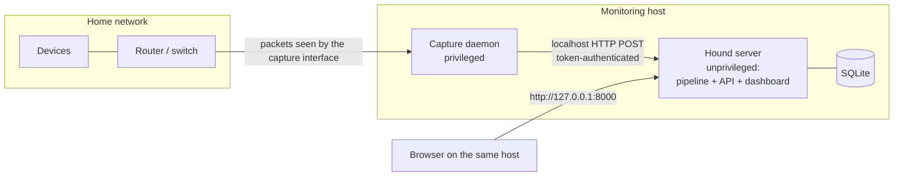
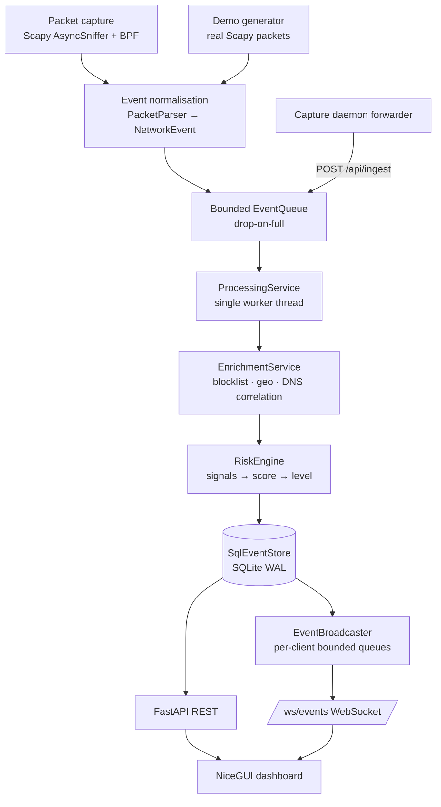

# Hound — Architecture & Infrastructure

> Status of this document: describes the **current** architecture (verified against the
> code on 2026-09-28, updated after task 14.1) and the **target** architecture it should grow into. Where the two
> differ, the gap is called out and tracked in [`ROADMAP.md`](ROADMAP.md).
> Decisions referenced as `ADR-NNN` live in [`DECISIONS.md`](DECISIONS.md).

---

## 1. System context

Hound is a **single-user, local-first** application. One machine captures (or simulates)
network traffic, analyses it and serves a dashboard to a browser on the same machine.
There is no cloud component and no multi-tenant concern.



## 2. Target pipeline

The target shape equals the current shape; the long-term work is hardening and
extension, not re-architecture.



In split mode (recommended for live capture) boxes A, B and a local queue run in the
**capture daemon** process, which forwards to `/api/ingest`; everything from the server's
queue onwards runs in the **unprivileged server** (ADR-002).

## 3. Component contracts

Each component: responsibility · inputs → outputs · depends on · failure modes · how it is
tested · extension points. File references are to the current code.

### 3.1 Packet capture — `app/ingestion/capture.py`
* **Responsibility:** open a capture on one interface with a BPF filter and hand every
  packet to the parser without blocking.
* **In → out:** raw frames → `NetworkEvent` via an `EventSink` callable (non-blocking `offer`).
* **Depends on:** Scapy, OS capture layer (libpcap / Npcap / BPF), `PacketParser`.
* **Failure modes:** permission denied; interface missing or disappears; libpcap missing
  (falls back to user-space filtering for the default filter); invalid BPF; sniffer thread
  dies (supervisor marks state `error`, surfaced in `/health`); loopback duplicates
  (de-duplicated, ADR-014).
* **Tests:** `tests/test_capture.py` with a fake `AsyncSniffer` (no root). Real capture
  verified manually on Linux loopback only.
* **Extension points:** multiple interfaces (one service per interface feeding the same
  queue); pcap-file replay source (Scapy `offline=`) for regression tests.

### 3.2 Event normalisation — `app/ingestion/parser.py`, `app/models/events.py`
* **Responsibility:** classify packets (DNS query / DNS response / TCP SYN; ignore
  SYN-ACK and everything else) and build the single event contract `NetworkEvent`.
* **In → out:** Scapy `Packet` → `NetworkEvent | None` (never raises; counts
  parsed/ignored/malformed).
* **Depends on:** Scapy layers, Pydantic, `app.core.netutils`.
* **Failure modes:** malformed/truncated payloads, non-ASCII names, old Scapy DNS section
  layout — all handled and counted.
* **Tests:** `tests/test_parser.py` (synthetic packets incl. truncation sweep),
  `tests/test_models.py`.
* **Extension points:** new `PacketType` values (e.g. TLS ClientHello SNI, DHCP, ARP) —
  add a parser branch and an enum value; downstream code dispatches on `packet_type`.

### 3.3 Event queue — `app/ingestion/queue.py`
* **Responsibility:** decouple producers from the consumer; bound memory.
* **In → out:** `offer(event) -> bool` (never blocks) → `get_batch(max, timeout)`.
* **Failure modes:** full queue → newest event dropped and counted (`events_dropped`).
* **Tests:** `tests/test_processing.py::test_event_queue_is_bounded`.
* **Extension points:** priority lanes (e.g. never drop blocklist hits) if drops are ever
  observed in practice.

### 3.4 Processing pipeline — `app/services/processing.py`
* **Responsibility:** the only writer: responses → state updates; queries/SYNs →
  enrich → score → persist → publish.
* **In → out:** batches of `NetworkEvent` → persisted `EventOut` + broadcast messages.
* **Depends on:** `EnrichmentService`, `RiskEngine`, `EventStore`, publisher callable.
* **Failure modes:** per-event exceptions counted and skipped; DB errors drop the batch,
  count it and surface `last_error` in `/health` (pipeline keeps running).
* **Tests:** `tests/test_processing.py`, `tests/test_demo.py` (full pipeline).
* **Extension points:** an alerting hook after persistence (publisher is already a
  pluggable callable).

### 3.5 Enrichment — `app/enrichment/`
* **Responsibility:** add blocklist match, destination country, domain inferred from
  earlier DNS answers, public/local destination flag.
* **In → out:** `NetworkEvent` → `Enrichment` (pure, no network I/O).
* **Depends on:** `Blocklist` (`DomainReputation` protocol), `GeoLocator` protocol,
  `ResolutionCache` (bounded LRU + TTL), `Allowlist` (`app/enrichment/allowlist.py`:
  domains via the blocklist's suffix matching, devices as IP networks).
* **Failure modes:** missing/empty blocklist (warning, reputation disabled); missing
  allowlist (info, nothing allowlisted); invalid allowlist lines (warning, skipped);
  broken geolocator (caught, country `None`).
* **Tests:** `tests/test_enrichment.py`, `tests/test_allowlist.py`.
* **Extension points:** real GeoIP (`GeoLocator`), multiple reputation feeds (compose
  `DomainReputation`s).

### 3.6 Risk engine — `app/risk/`
* **Responsibility:** deterministic, explainable scoring (ADR-009).
* **In → out:** `(NetworkEvent, Enrichment)` → `RiskAssessment(score, level, reasons)`.
* **Depends on:** `RiskConfig` (defaults < `config/risk.toml` < explicitly set
  `HOUND_RISK_*` settings; `RiskConfig.from_settings`, ADR-022), `DeviceBehaviorTracker`
  (bounded, event-time sliding windows).
* **Failure modes:** state lost on restart (by design, windows are ≤ minutes); memory
  bounded by device/entry caps.
* **Allowlist policy** (`apply_allowlist`, ADR-021): after the signals run, indicators
  covered by an allowlisted domain (all) or device (all except `BLOCKLISTED_DOMAIN`) are
  removed from the score and listed in one 0-point `ALLOWLISTED` reason.
* **Tests:** `tests/test_risk.py` (every signal, thresholds, cap, determinism, bounds),
  `tests/test_allowlist.py` (policy).
* **Configuration file:** `load_risk_file()` parses `config/risk.toml` with stdlib
  `tomllib` into strict Pydantic sections (unknown keys rejected, ranges checked);
  `RiskConfigError` stops `serve` before the web server starts (exit 2) and is reported
  by `doctor`. `tests/test_risk_config.py` includes a drift guard: uncommenting every
  value in the shipped file must reproduce `RiskConfig()` exactly.
* **Extension points:** add a class implementing `RiskSignal` (and its weight to
  `RiskWeights`, the `[weights]` section and the shipped file — the drift guard fails
  until all three agree).

### 3.7 Persistence — `app/database/`, `app/services/store.py`
* **Responsibility:** atomically store events and update device aggregates; retention.
* **In → out:** `ProcessedEvent`s → rows; repositories → ORM records for queries.
* **Depends on:** SQLAlchemy 2, SQLite (WAL, `busy_timeout`).
* **Failure modes:** locked/unwritable DB (e.g. created by root), disk full, corrupted
  JSON columns (re-validated on read).
* **Tests:** `tests/test_database.py`.
* **Schema versioning:** `PRAGMA user_version` + ordered atomic migrations in
  `app/database/migrations.py` (ADR-018); legacy v1.0 databases are adopted; newer or
  foreign databases are refused unchanged. Tests: `tests/test_migrations.py` (incl. a
  guard that the migrated schema equals the ORM models).
* **Backup / restore** (`app/database/backup.py`, ADR-024): `create_backup` uses SQLite's
  online backup API (consistent while the server writes), creates the copy owner-only
  before writing, converts it to a single file (`journal_mode=DELETE`) and requires
  `integrity_check = ok`, deleting the copy otherwise. `restore_backup` validates the
  backup read-only (`app/database/inspect.py`: integrity, schema version, Hound
  structure), moves the current database and its `-wal`/`-shm` aside (never deletes),
  copies the backup in, and rolls back on failure (removing the file at the database path
  only if it is the partial copy, never the original). The CLI refuses to restore while a
  Hound answers on the configured port. Tests: `tests/test_backup.py`.

### 3.8 API — `app/api/`
* **Responsibility:** thin HTTP layer: validation, auth for ingest, JSON contracts.
* **In → out:** HTTP requests → Pydantic schemas (`app/models/schemas.py`).
* **Depends on:** `HoundRuntime` services via `request.app.state` (no globals).
* **Failure modes:** DB errors → 503; bad input → 422; bad token → 401; big body → 413;
  foreign Host → 400.
* **Tests:** `tests/test_api.py`, `tests/test_frontend.py` (client contract).
* **Extension points:** versioned prefix (`/api/v2`) if a breaking change is ever needed;
  export endpoints.

### 3.9 Realtime event bus — `app/services/broadcaster.py`, `app/api/routes/ws.py`
* **Responsibility:** push new events to subscribers without polling the DB.
* **In → out:** list of messages from the worker thread → per-subscriber bounded
  `asyncio.Queue` → WebSocket JSON frames (plus `hello` / `heartbeat`).
* **Failure modes:** slow client (oldest messages dropped for that client only); client
  disconnect (detected by a concurrent receive task); foreign Origin (closed with 1008).
* **Tests:** `tests/test_api.py::test_websocket_*`, `tests/test_processing.py::test_broadcaster_*`.
* **Extension points:** server-side filtering per subscription (e.g. only dangerous).

### 3.10 Dashboard — `app/frontend/`
* **Responsibility:** present state; never touches SQLite (ADR-007).
* **In → out:** REST snapshots + WebSocket events → NiceGUI components.
* **Failure modes:** API unreachable (error banner, retries); WebSocket down (polling
  fallback every 5 s); bursts (buffered, flushed every 0.5 s, feed capped at 200 rows).
* **Tests:** pure helpers and API client in `tests/test_frontend.py`; page behaviour in
  `tests/test_dashboard.py` (NiceGUI user simulation, real API over ASGI, live events via
  `LiveEventStream.dispatch`). `DashboardPage` takes its API client and stream as
  constructor arguments, which is what makes it testable without a server. Visual
  appearance is checked manually.
* **Extension points:** new tabs are self-contained panels on `DashboardPage`.

### 3.11 Composition & lifecycle — `app/services/runtime.py`, `app/api/app.py`, `app/cli.py`
* **Responsibility:** build and wire all components; start/stop order; run modes
  (`idle`, `demo`, `capture`); CLI commands (`serve`, `capture`, `interfaces`, `doctor`,
  `reload`). `HoundRuntime.reload_detection_config()` (ADR-023) re-reads the blocklist,
  allowlist and risk settings, validates everything first, then swaps them through
  `ProcessingService.reconfigure()` — under the lock held for each batch — via
  `EnrichmentService.update_lists()` (DNS answer cache kept) and `RiskEngine.reconfigure()`
  (behaviour tracker kept unless the window length changes). Exposed as the
  token-protected `POST /api/admin/reload` (`app/api/routes/admin.py`).
* **Failure modes:** DB init failure aborts start-up with a clear log line; source
  failures are non-fatal (API/dashboard keep running).
* **Shutdown order:** source stop → worker drains queue → broadcaster unbind → engine
  dispose (FastAPI lifespan). Capture daemon: SIGINT/SIGTERM → capture stop → forwarder
  final flush.

### 3.11a Environment diagnostic — `app/services/doctor.py` (`doctor` command)
* **Responsibility:** read-only checks of what Hound needs from the machine (Python,
  packages vs. `requirements.lock`, capture driver via Scapy's own detection, privileges,
  interface, bind address, port, cloud-synced data folder, database, ingest token); one
  status + fix per check; exit code 1 on any failure.
* **Read-only guarantee:** never creates the database, token or directories. The database
  is opened `mode=ro`, and additionally `immutable=1` when no `-wal` file exists — plain
  read-only mode would otherwise create `-wal`/`-shm` files (verified; SQLite gives them
  the database file's permissions, so this is about not writing, not about exposure —
  an earlier note here claiming "default permissions" was wrong). Shared helpers live in
  `app/database/inspect.py` (also used by backup/restore). The port check binds and releases a socket; if the port is taken it
  identifies a running Hound via `GET /health` (proxy-free opener, ADR-016).
* **Tests:** `tests/test_doctor.py` — each check's outcomes (platform-specific ones via
  injected inputs, so the Windows/Npcap branch runs on Linux), a real running server,
  the read-only guarantee (directory snapshot before/after), and the CLI exit codes.

### 3.12 Capture daemon & forwarder — `app/ingestion/daemon.py`, `forwarder.py`
* **Responsibility:** privileged process: capture → local queue → batched POSTs.
* **Failure modes:** API down (exponential back-off 1→16 s, 5 attempts, then the batch is
  dropped and counted); bad token (logged, not retried); own traffic captured (filtered by
  `SelfTrafficFilter`, ADR-014); proxy in the environment (ignored for the local API).
* **Reporting:** every POST carries the daemon's cumulative counters (`daemon` field of
  `IngestRequest`, re-read on each retry): parsed/malformed packets, local queue drops
  and peak, forwarded and dropped events, failed attempts (ADR-020). The server keeps the
  latest report for `/api/metrics`. Daemon and server must come from the same Hound
  version: an older server rejects the field (422).
* **Tests:** `tests/test_forwarder.py` (injected transport); `tests/test_daemon.py` runs
  split mode end to end without privileges — real parser → daemon → forwarder → live
  uvicorn server → pipeline → SQLite — with only the Scapy sniffer faked (96 % coverage of
  `daemon.py`). Daemon → API traffic never uses proxy settings (ADR-016 revisited).

## 4. Dependency rules (enforced by convention, checked in review)

```text
core                    ← imported by everyone; imports nothing outside app.core
models                  → core.netutils only
ingestion               → models, core            (never database/api/frontend)
enrichment, risk        → models, core
database                → models, core
services                → ingestion.queue/sources, enrichment, risk, database, models, core
api                     → services, models, core
frontend                → core.config + its own HTTP/WS client only (no backend packages)
cli                     → api, services, ingestion, core
```

Verified on 2026-09-28: every module imports standalone (no circular imports), and
`app.frontend` imports no backend package.

## 5. Infrastructure plan

### 5.1 Runtime
| Topic | Current | Target |
|---|---|---|
| Python | 3.11+; suite executed on 3.11.15 and 3.13.7 (Linux); CI workflow covers 3.11/3.13 on Linux, Windows, macOS (ADR-017) | CI green on every push |
| Environment | `venv` + `requirements.lock` (hash-checked, universal; generated from the ranges in `requirements.txt`, ADR-019) | unchanged |
| Entry points | `python run.py`, `python -m app`, `hound` (editable install) | unchanged |
| Process model | 1 server process; optional 1 capture daemon | unchanged; optional OS service units (Phase 21) |
| Configuration | `HOUND_*` env / `.env` / CLI, validated by Pydantic (ADR-010) | unchanged; add `hound config check` diagnostic |

### 5.2 Data
| Topic | Current | Target |
|---|---|---|
| Engine | SQLite, WAL, `synchronous=NORMAL`, `busy_timeout=5000` | unchanged |
| Schema | `events`, `devices`; 7 + 2 indexes; version 1 in `PRAGMA user_version`; ordered atomic migrations (ADR-018) | unchanged |
| Retention | newest 250 000 events kept (checked every 50 batches) | plus device-row expiry and optional time-based retention |
| Size | measured ≈ 390 B/event → ≈ 93 MiB at the default cap | documented sizing guidance |
| File permissions | POSIX: data dir created `0700`, DB/WAL/SHM `0600`; Windows: profile ACLs | unchanged |
| Backup | none | `hound db backup` using SQLite online backup API; export CSV/JSON |

### 5.3 Networking & capture
| Topic | Current | Target |
|---|---|---|
| Interface discovery | `python run.py interfaces`; name, description or Windows `\Device\NPF_{…}` network name accepted | unchanged |
| BPF | default: DNS (UDP/TCP 53) + IPv4 SYN | optional IPv6 SYN clause documented; consider making it default after testing |
| Permissions | split mode; setcap/ChmodBPF/Npcap documented | unchanged |
| Platforms | live capture verified on **Linux only**; Windows admin detection implemented but not yet executed on Windows | verified on Windows (primary user platform) and macOS |
| IPv6 | parsed everywhere; SYN filter IPv4-only | full IPv6 SYN coverage |

### 5.4 Application
* FastAPI + Uvicorn (single worker — required: runtime state is in-process).
* NiceGUI mounted on the same app; talks to the API over loopback HTTP/WS.
* Background workers: capture thread (+ supervisor), processing thread, demo thread,
  forwarder thread. All daemon threads with explicit stop events and joins.
* Graceful shutdown: see §3.11. Target: shutdown timeout guarantees and a test for it.

### 5.5 Observability
| Topic | Current | Target |
|---|---|---|
| Logs | text or JSON, `extra` fields, per-event data only at DEBUG | unchanged |
| Health | `/health` (DB ping, source state, worker alive, counters) | unchanged |
| Metrics | `GET /api/metrics` (`HoundRuntime.metrics()`, ADR-020): loss per stage + total, queue high-water, batch latency p50/p95 (last 1 000 batches), ingest rejections, WS drops, DB/WAL size, retention pruning, daemon report. In-memory, reset on restart | persist or export only if a field trial shows the need |
| Diagnostics | `python run.py doctor` (read-only checks, fix per problem) | unchanged |

### 5.6 Security
Least privilege (ADR-002), loopback bind, Host allow-list, WebSocket Origin check, token
ingest with pre-body auth and size caps, SQLAlchemy bound parameters, JSON-only
deserialisation with re-validation, bounded buffers everywhere, no secrets in the repo.
Detailed hardening plan: [`ROADMAP.md` §J](ROADMAP.md#j-security-roadmap).

## 6. Designing for the future (constraints on today's code)

| Future capability | Keep true today |
|---|---|
| Real GeoIP | Only `build_geolocator()` knows implementations; everything else uses `GeoLocator`. |
| TLS SNI / DHCP / ARP observations | New observation kinds are new `PacketType`s on `NetworkEvent`; do not add side channels around the queue. |
| Device fingerprinting / MAC identity | Device key is `source_ip` today; do not spread that assumption beyond `DeviceRepository` and `DeviceOut`. Schema changes go through a new migration (ADR-018). |
| Configurable rules | Signals read thresholds/weights only from `RiskConfig`; no literals in signal code. |
| Alerting | Hook after `SqlEventStore.save()` (same place as the publisher); never inside the capture callback. |
| Multiple interfaces | Sources are independent `EventSource`s sharing one queue; the parser takes the interface name per packet. |
| Remote dashboard | Keep the dashboard an API client (ADR-007); add auth at the API edge, not inside the UI. |
| Docker / service | All paths resolve from settings; no reliance on CWD; capture stays a separate process. |
| Other databases | SQL only in `app/database/repositories.py`; SQLite pragmas isolated in `engine.py`. |
