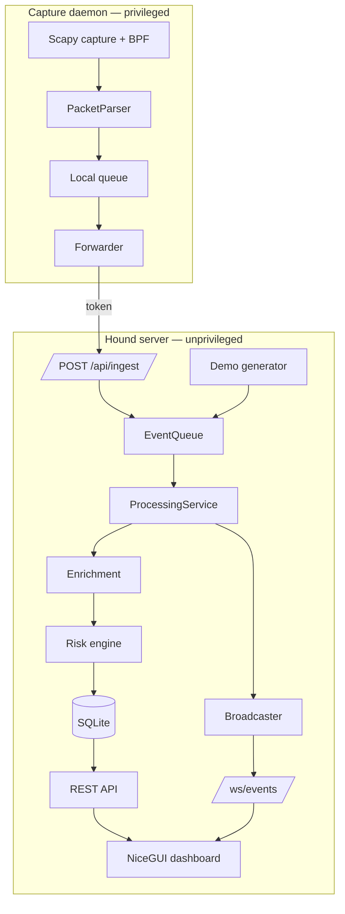
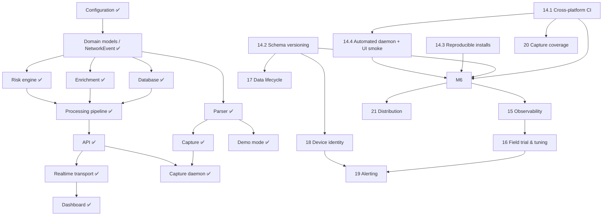

# Hound — Roadmap

> Living plan. The repository is the source of truth: if code and this file disagree,
> fix this file. Current position and the next task are in
> [`PROJECT_STATUS.md`](PROJECT_STATUS.md); architecture in
> [`ARCHITECTURE.md`](ARCHITECTURE.md); decisions in [`DECISIONS.md`](DECISIONS.md).
>
> Last reviewed: 2026-09-28 (15a done; next: 15b `/api/metrics`).

---

## A. Executive roadmap

The initial build delivered a working vertical system (capture → pipeline → SQLite →
API → WebSocket → dashboard, plus demo mode). Phases 0–13 of the original plan are done
and verified **on Linux**. The work ahead is not new architecture; it is making that
system trustworthy on the owner's real platform (Windows) and network, then extending it.

| Stage | Phases | Milestone | State |
|---|---|---|---|
| Foundation → working system | 0–13 | M0–M5 | ✅ Done (Linux-verified) |
| **Release hardening** | **14** | **M6 — Production-quality local build** | 🔶 In progress (rest waits on owner) |
| **Observe & tune on a real network** | **15–16** | **M7 — Field-validated** | 🔶 **In progress** (15a done) |
| Data lifecycle & device identity | 17–18 | M8 — Durable & device-aware | Not started |
| Alerting | 19 | M9 — Actionable | Not started |
| Coverage & distribution | 20–21 | M10 — Distributable 1.0 | Not started |

Principles: one vertical slice at a time; the app must start and all tests must pass after
every task; no new frameworks without an ADR; measure before optimising.

---

## B. Milestones

| ID | Milestone | Exit criteria | Status | Evidence |
|---|---|---|---|---|
| M0 | Architecture ready | layered packages, config, logging, models | VERIFIED | module-import check; `ARCHITECTURE.md` §4 |
| M1 | First event | synthetic event → processing → SQLite → API | VERIFIED | `tests/test_processing.py`, `tests/test_api.py` |
| M2 | Real packet | authorised packet captured & normalised | VERIFIED (Linux only) | manual run on `lo`, split mode (server as `nobody`, daemon as root) |
| M3 | Security intelligence | enrichment + deterministic risk | VERIFIED | `tests/test_enrichment.py`, `tests/test_risk.py` |
| M4 | Live dashboard | UI shows events live | VERIFIED (manual) | Playwright run: live rows update, dialogs, filters, dark/mobile |
| M5 | Demo complete | full app without privileges | VERIFIED | `scripts/smoke_test.py` 12/12 |
| **M6** | **Production-quality local build** | green on Windows/macOS/Linux CI; versioned schema; reproducible install; automated daemon/dashboard smoke; docs current | **IN_PROGRESS** | see Phase 14 |
| M7 | Field-validated | ≥ 7 days on the owner's network; false-positive review done; metrics show no drops | NOT_STARTED | |
| M8 | Durable & device-aware | backups/export; device identity beyond IP | NOT_STARTED | |
| M9 | Actionable | opt-in alerts for dangerous events | NOT_STARTED | |
| M10 | Distributable 1.0 | installable package, service mode, release notes | NOT_STARTED | |

---

## C. Architecture diagram



---

## D. Dependency graph (implementation order)

What must exist before what. ✅ = exists and verified.



Hard dependencies worth remembering:
* **Any schema change** (device names, MAC, alert state) requires 14.2 first.
* **Detection tuning** without metrics (15) is guesswork.
* **Windows claims** in the README are unverified until 14.1.

---

## E. Vertical slices

Every phase below is planned as thin end-to-end slices that keep the app runnable. The
first slice (synthetic DNS event → normalised → risk → SQLite → API → dashboard) is done.
Examples for upcoming work:

* 14.2: add `user_version`, a no-op migration 1 → *app starts on old and new DBs* → first
  real migration only when a feature needs it.
* 18: capture source MAC on SYN/DNS → store on event → show in device dialog → *then*
  friendly names and DHCP.
* 19: one alert rule (blocklist hit) → one channel (desktop notification) → then more.

---

## F. Detailed roadmap

### Phases 0–13 — completed (initial build)

| Phase | Deliverable in repo | Status | Evidence / gap |
|---|---|---|---|
| 0 Discovery & architecture | layered packages, ADRs | VERIFIED | `ARCHITECTURE.md`, `DECISIONS.md` |
| 1 Foundation | `app/core`, `run.py`, CLI, `.env.example` | VERIFIED | `tests/test_config.py`, `tests/test_cli_and_security.py` |
| 2 Domain/event model | `app/models` | VERIFIED | `tests/test_models.py` |
| 3 Database | `app/database` | VERIFIED | `tests/test_database.py`, `tests/test_migrations.py` — versioned since 14.2 |
| 4 Packet ingestion | `app/ingestion/{capture,parser,daemon,forwarder}` | VERIFIED (Linux) | unit + split-mode end-to-end tests (`tests/test_daemon.py`); live capture manual |
| 5 Processing pipeline | `app/services/{processing,store,runtime}` | VERIFIED | `tests/test_processing.py` |
| 6 Enrichment | `app/enrichment` | VERIFIED | `tests/test_enrichment.py` |
| 7 Risk engine | `app/risk` | VERIFIED | `tests/test_risk.py` — real-traffic tuning pending (16) |
| 8 FastAPI | `app/api` | VERIFIED | `tests/test_api.py`, `/docs`, `/redoc` |
| 9 Realtime transport | broadcaster + `/ws/events` | VERIFIED | WS tests + smoke test |
| 10 Dashboard | `app/frontend` | VERIFIED | `tests/test_dashboard.py` (NiceGUI user simulation vs. real API); visuals manual |
| 11 Demo/simulation | `app/ingestion/demo.py` | VERIFIED | `tests/test_demo.py`, smoke test |
| 12 Testing & hardening | 299 tests, 93 % coverage, ruff + mypy clean (mypy also checked for win32/darwin) | VERIFIED (Linux) | Linux Py 3.11 + 3.13; Windows run by owner up to 14.4a; macOS via CI once on GitHub |
| 13 Documentation | README (20 sections), docs/ | FUNCTIONAL | Windows statements corrected in 14.1; not yet confirmed on a Windows machine |

### Phase 14 — Release hardening → M6 *(current)*

**Goal:** a build the owner can trust on their own platform, whose data survives upgrades
and whose installs are reproducible.
**Prerequisites:** phases 0–13 (done).

#### 14.1 Cross-platform verification & CI — **DONE for Windows** (CI/macOS pending a GitHub repo)
* **Tasks**
  1. Add `.github/workflows/ci.yml`: matrix `ubuntu-latest`, `windows-latest`,
     `macos-latest` × Python 3.11, 3.13; steps: install, `ruff check`, `mypy app`,
     `pytest`, `python scripts/smoke_test.py`; plus a `pip-audit -r requirements.txt` job.
  2. Fix known Windows test failures (by inspection): `tests/test_config.py`
     lines 70 and 73 compare against back-slashed paths while the code emits POSIX paths.
  3. `resolve_interface()` also accepts Scapy's Windows `network_name`
     (`\Device\NPF_{…}`); correct README §9, which wrongly says the friendly name is in the
     DESCRIPTION column (Scapy's `name` *is* the friendly name).
  4. Add a Windows note for the ingest-token file (POSIX `0600` is ignored).
* **Deliverables:** CI workflow; fixes; README corrections; `PROJECT_STATUS.md` updated.
* **Tests:** whole suite on 3 OS; new unit test for NPF-name resolution.
* **Acceptance:** CI green on all 6 matrix cells; owner runs `pytest` and
  `python run.py --demo` successfully on their Windows laptop.
* **Risks:** hidden Windows-only issues (signals, file locking of SQLite during test
  teardown, NiceGUI/uvicorn on Proactor loop). Mitigation: fix forward inside this task;
  anything larger becomes its own item.
* **Needs from owner:** a GitHub repository (or run `pytest` locally and share output).
* **Outcome (2026-09-28):** all four tasks implemented. Added `requirements-dev.txt`
  (ruff, mypy, pip-audit) and moved lint/type settings into `pyproject.toml` so local runs
  match CI (ADR-017). Also fixed: `_is_privileged()` now detects an elevated Administrator
  on Windows (it always returned False there). Replicating CI on a fresh Python 3.13 env
  surfaced 5 errors from mypy 2.x (stricter than 1.x) that CI would have hit: Pydantic
  `Field(None, …)` positional defaults (now `default=`), an `int` returned as `bool`, and an
  untyped dashboard value — all fixed; OpenAPI schema verified byte-identical.
  **First Windows run (owner):** 208/209 — `test_ipv6_dns_query` built a packet with a bare
  `Ether()`, so Scapy consulted the host's IPv6 route and hit an adapter it can't resolve.
  Fixed with explicit MACs in all test packets and a session-wide conftest guard that
  makes every Scapy route lookup return a non-existent adapter (reproduces the failure on
  any OS). **Owner re-run on Windows: pytest and smoke test all green → 14.1 closed.**
  Residual: the CI workflow has not executed yet (no repository), so macOS is untested;
  Windows live capture is a separate manual check (M2).

#### 14.2 Schema versioning & migrations — **DONE**
* **Tasks:** store schema version in `PRAGMA user_version`; `app/database/migrations.py`
  with ordered `(version, fn)` steps executed in a transaction at start-up; refuse to start
  (clear message) on a DB newer than the code; mark current schema as version 1.
* **Tests:** fresh DB → v1; pre-versioning DB (user_version 0 with tables) → adopted as v1;
  simulated v2 migration on a copy; "newer DB" refusal.
* **Acceptance:** existing `data/hound.db` files keep working; ADR-015 superseded.
* **Risk:** SQLite `ALTER TABLE` limits → use table-rebuild pattern inside a transaction.
* **Outcome (2026-09-28):** `app/database/migrations.py` (ADR-018): frozen v1 baseline,
  every database migrated through the same ordered steps, one `BEGIN IMMEDIATE`
  transaction per step incl. the version bump; legacy adoption only on an exact structure
  match; newer/foreign databases refused unchanged. Beyond the plan: a drift test (migrated
  schema == ORM models), S-8 file permissions, and a CLI pre-flight so a refused database is
  a one-line error instead of a ~60-line uvicorn traceback. Verified on a real database
  created by the previous release (385 events, 6 devices preserved, mode 644 → 600).
  16 new tests; each key behaviour mutation-checked (removing it makes a test fail).

#### 14.3 Reproducible installs & release hygiene
*Sequencing note (2026-09-28): moved after 14.4 because two of its items wait for owner
decisions (license, version label); 14.4 is fully unblocked. Order within M6 is otherwise
unaffected. Split after 14.4: **14.3a** lock file + CHANGELOG (unblocked); **14.3b**
LICENSE + version label (owner decisions).*

**14.3a Lock files + CHANGELOG — DONE (2026-09-28)**
* `requirements.lock` + `requirements-dev.lock` (universal, hash-checked, `uv pip compile`;
  ADR-019); CI installs the dev lock, audits both locks, and runs the unpinned ranges in a
  non-blocking job; `tests/test_dependency_locks.py` guards lock ↔ range consistency.
* Verified: binary-only resolution for Windows/macOS/Linux × Py 3.11–3.14; fresh installs
  with plain pip on 3.11 and 3.13 pass every check; pip-audit clean.
* `CHANGELOG.md` created. `pytest` stays in `requirements.txt` for now (owner preference
  not stated; moving it is a 14.3b question).

**14.3b LICENSE + version label — blocked on owner decisions.**
* **Tasks:** generated lock file (`requirements.lock` via `pip-compile` or `uv pip
  compile`, dev-only tool) used by CI; `CHANGELOG.md`; version policy (owner decision:
  keep 1.0.0 or re-label 0.9.0 until M6); **LICENSE** (owner decision); move `pytest` to
  an optional `[dev]` extra if the owner prefers a lean runtime install.
* **Acceptance:** `pip install -r requirements.lock` reproduces CI's environment.

#### 14.4 Automated coverage for the daemon and dashboard
Split into two sessions (too large to verify properly in one):

**14.4a Capture daemon + parser fuzzing — DONE (2026-09-28)**
* `tests/test_daemon.py`: split mode end to end without privileges — a fake capture feeds
  real frames through the real `PacketParser` into `CaptureDaemon`, which forwards to a
  live uvicorn server; covers delivery + server-side enrichment, self-traffic filtering,
  capture start failure (exit 2), failure while running (exit 3), API down at start then
  recovering, statistics logging, `capture` without a token, and proxy settings.
* **Bug found and fixed:** the daemon's HTTP calls honoured `HTTP(S)_PROXY`, so behind a
  proxy it delivered nothing (ADR-016 revisited). The test runs in a fresh process because
  the opener reads the environment at import time — an in-process version passed even
  with the bug.
* S-3: deterministic fuzz test (800 random + 1 600 mutated/truncated frames, dissected the
  way Scapy's capture socket does).
* `CaptureDaemon.stop()` added (public, thread-safe).
* Coverage: `daemon.py` 0 → 96 %, `forwarder.py` 75 → 93 %, total 80 → 83 %.
  Mutation-checked: disabling the parser's error handling, the self-traffic filter or the
  proxy bypass each makes a test fail.
* Dropped from the plan: "move the smoke test into pytest" — CI already runs
  `scripts/smoke_test.py` directly (since 14.1), so it would only duplicate it.

**14.4b Dashboard — DONE (2026-09-28)**
* `tests/test_dashboard.py` (12 tests): `nicegui.testing.user_simulation` builds the real
  `DashboardPage` (dependency injection made `ui.run_with` irrelevant for most tests)
  against the **real** API over `httpx.ASGITransport`; live events enter through
  `LiveEventStream.dispatch`, outages through a switchable transport. `mount_dashboard`
  itself is tested in a subprocess (served page + once-per-process guard).
* Covers render, live batching/cap/order, risk filter, pause, polling fallback, event and
  device dialogs, error banner + recovery, pipeline-state banners, include-local switch.
* Coverage: `dashboard.py` 0 → 96 %, `components.py` 0 → 91 %, total 83 → 92 %.
  Mutation-checked with 9 deliberate breakages; each caught.
* No Playwright dependency added; visual appearance (colours, layout, dark mode) remains a
  manual check.
* **Definition of done (Phase 14):** all four items done + M6 exit criteria met.

*Sequencing note (2026-09-28): every remaining Phase 14 item now waits on the owner
(LICENSE/version, GitHub repo for CI/macOS, Windows live capture). Phase 15 starts
meanwhile, with the diagnostic that helps the owner's Windows live-capture test first.
M6 stays open until its exit criteria are met.*

### Phase 15 — Observability & diagnostics
* **Goal:** know what the system is doing before tuning it.
* **Tasks:** `/api/metrics` (JSON: queue high-water mark, batch latency p50/p95, drops per
  stage, WS drops, parser malformed rate, DB size); `hound doctor` (Python, Scapy,
  libpcap/Npcap, privileges, interface, port, DB writability); commit the benchmark script
  (`scripts/benchmark.py`) used for the baseline in §I.
* **Slices:** 15a `hound doctor` — **DONE** · **15b `/api/metrics` ← next task** · 15c benchmark script.
* **15a outcome (2026-09-28):** `python run.py doctor [-i IFACE]` (`app/services/doctor.py`),
  10 read-only checks with a fix per problem, exit 1 on failure; verified against a real
  running server; the read-only guarantee needed SQLite's `immutable` mode (plain
  read-only mode creates `-wal`/`-shm` files). 35 tests, mutation-checked. The owner's
  Windows run then exposed an older bug: the database URL was built from the unencoded
  path (`%20`/`?` in a folder name broke it) — fixed, with location-asserting tests.
* **Acceptance:** a field trial can answer "did we lose anything?" from metrics alone;
  `hound doctor` names the fix for each environment problem it finds.
* **Risk:** metric creep — keep to counters that drive a decision.

### Phase 16 — Field trial & detection tuning → M7
* **Tasks:** run on the owner's network ≥ 7 days (split mode); review every
  suspicious/dangerous event; add an **allowlist** (domains/devices never flagged);
  load signal weights/thresholds from an optional TOML file (stdlib `tomllib`, no new
  dependency); blocklist reload without restart; document tuning results.
* **Acceptance:** false-positive rate documented and accepted by owner; no drops in metrics.
* **Known candidates:** NXDOMAIN burst flags a device's *next* normal queries; CDN
  hostnames trip the entropy signal; `NO_PRIOR_DNS_LOOKUP` fires for capture started
  mid-session.

### Phase 17 — Data lifecycle
* **Tasks:** `hound db backup` (SQLite online backup API), CSV/JSON export endpoint,
  device-row expiry, optional time-based retention, periodic `PRAGMA optimize`.
* **Prereq:** 14.2. **Acceptance:** restore from backup verified by test.

### Phase 18 — Device identity → M8 (with 17)
* **Tasks:** record source MAC (from Ethernet header) → device table; ARP/DHCP observations
  as new `PacketType`s; user-assigned device names; IP changes do not split history.
* **Prereq:** 14.2. **Risk:** MAC randomisation on phones → names attach to MAC *and* show
  "possibly the same device" hints rather than silent merges.

### Phase 19 — Alerting → M9
* **Tasks:** alert rules (start: blocklist hit, dangerous device), de-duplication/cool-down,
  channels (desktop notification first, then webhook/e-mail), alert history in UI.
* **Prereq:** 16 (tuned signals, otherwise alert fatigue), 17/18 for context.

### Phase 20 — Capture coverage
* **Tasks:** IPv6 SYN clause in default BPF after testing; multiple interfaces; optional
  TLS SNI extraction; pcap-replay source for regression tests; macOS live verification.

### Phase 21 — Distribution → M10
* **Tasks:** rename package `app` → `hound` (ADR-011 revisit); wheel/pipx install; service
  units (systemd/launchd/Windows service for the daemon); optional Docker image (Linux,
  `--net=host`, `NET_RAW`); release notes; tag 1.0.

---

## G. Definition of Done (project-wide)

A task is **done** only when all apply:
1. Implementation exists and is wired in (no dead code, no placeholders).
2. `python -m compileall`, `ruff check`, `mypy app` pass.
3. Tests cover the new behaviour; the **whole** suite passes (never delete or skip tests to
   get green).
4. `python run.py --demo` starts and `scripts/smoke_test.py` passes.
5. README / `.env.example` / docs updated if behaviour, config or API changed.
6. No security regression (checked against §J); no new dependency without an ADR.
7. `PROJECT_STATUS.md` updated; ADR added for significant decisions.

"Code written" ≠ done. Unverifiable items are reported as such, not marked done.

---

## H. Testing strategy

```text
                 E2E  (smoke test 12 checks; manual live capture; manual Playwright)
               /      \
        API tests        Integration
     (26: test_api,     (43: database, migrations, processing, demo, daemon split mode)
      test_frontend)
          /                      \
   Unit (164: config, netutils, models, parser incl. fuzz, capture*, enrichment, risk, forwarder, cli)
```
\* capture tests use a fake sniffer — no root, no traffic.

| Level | Belongs here | Rules |
|---|---|---|
| Unit | parsing, normalisation, validation, each risk signal, blocklist, geo, config | pure, deterministic, event-time based; test packets use explicit MACs (`tests.conftest.eth()`) — host routing is disabled for the whole suite |
| Integration | repositories on a temp SQLite file, processing worker, demo pipeline | temp dirs only; no network |
| API | HTTP status codes, schemas, auth, WS, Host/Origin checks | FastAPI `TestClient` / `httpx.ASGITransport` |
| E2E | server + demo + WS; daemon split mode (`test_daemon.py`); dashboard page vs. real API (`test_dashboard.py`) | free port or in-process ASGI, temp DB |
| Manual | live capture per OS | recorded in `PROJECT_STATUS.md` with date/platform |

**Fixtures to consolidate (14.4):** move inline packet builders into
`tests/fixtures/packets.py` (DNS query/response/NXDOMAIN, SYN, SYN-ACK, IPv6, truncated,
non-DNS on port 53); scenario builders for multiple devices, repeated connections, port
scan, host sweep (exist inline in `test_risk.py`); small `.pcap` fixtures generated from
synthetic packets for replay tests (Phase 20).

Current numbers (2026-09-28, after 15a + URL fix): 299 tests, 93 % line coverage (`migrations.py` 100 %,
`daemon.py` 96 %, `dashboard.py` 96 %, `doctor.py` 93 %, `components.py` 91 %); gaps:
`frontend/client.py` 68 % (WebSocket reconnect loop), `cli.py` 79 %, `core/logging_config.py` 40 %.
The suite takes ~21–24 s (dashboard ~9.7 s, daemon ~4.5 s, doctor ~3 s).

---

## I. Performance plan

**Measured baseline** (dev sandbox, 1 vCPU class, Python 3.11, demo traffic mix):

| Path | Result |
|---|---|
| Scapy dissection of raw frames | ≈ 4 700 pkt/s — **the bottleneck** |
| Parser (dissected packet → `NetworkEvent`) | ≈ 14 500 pkt/s |
| Processing, batch = 1 | ≈ 800 events/s |
| Processing, batch = 50–200 (enrich + risk + commit) | ≈ 5 400 events/s |
| `/api/stats` at 13 k / 250 k rows | 7 ms / 71 ms |
| `/api/stats/countries` at 250 k rows | 41 ms |
| `/api/events` (50 rows, incl. total count) at 250 k rows | 5 ms (16 ms with domain substring) |
| DB size | ≈ 390 B/event → ≈ 93 MiB at the 250 000-event cap |
| Process RSS during benchmark | ≈ 185 MiB |

A busy home network produces tens of DNS queries and SYNs per second — two orders of
magnitude below these limits. **No optimisation is planned now.**

**Measure before changing** (Phase 15 metrics): queue high-water mark, drops per stage,
batch latency, WS per-client drops, `/api/stats` latency.

**Triggers → options**
* `/api/stats` > 200 ms or multiple dashboards open → maintain counters incrementally in
  the worker instead of `COUNT(*)` scans.
* Queue drops > 0 in real use → profile Scapy dissection; consider `conf.layers.filter`
  to dissect only needed layers; priority lane for blocklist hits.
* DB > 500 MiB → lower retention or time-based retention; `VACUUM` after prune.
* UI sluggish → lower feed cap, increase flush interval; never one update per packet.

---

## J. Security roadmap

| ID | Area | Item | Status |
|---|---|---|---|
| S-1 | Capture | Only the daemon is privileged; no DB/API/UI code in it | Done (ADR-002) |
| S-2 | Capture | Interface validated against Scapy's list (name, description or Windows NPF name) | Done (14.1) |
| S-3 | Capture | Parser never raises; truncation sweep + deterministic random/mutated-frame fuzz test | Done (14.4a) |
| S-4 | API | Loopback bind, Host allow-list, WS Origin check, warning on non-loopback bind | Done |
| S-5 | API | Rate limiting | Not needed on localhost; revisit with remote dashboard |
| S-6 | Config | Ingest token file: `0600` on POSIX; Windows relies on profile ACLs — documented in README §12, plus a cloud-sync warning in §18 | Done (documented, 14.1) |
| S-7 | API | Cap inbound WS frame size (clients never need to send) | Open (15) |
| S-8 | Database | New `data/` dir `0700`; DB, `-wal`, `-shm` tightened to `0600` on POSIX (browsing metadata); pre-existing dirs untouched | Done (14.2) |
| S-9 | Database | Bound parameters only; LIKE escaping; retention | Done |
| S-10 | Dependencies | Hash-checked lock files (ADR-019); CI audits the exact locked versions (2026-09-28 local run: no known vulnerabilities) | Done (14.3a); CI run pending a GitHub repo |
| S-11 | Application | Domains logged only at DEBUG; review before adding new log lines | Done; keep |
| S-12 | Application | Strict CSP for the dashboard | Blocked by NiceGUI inline scripts; revisit if remote access is ever added |
| S-13 | Remote access | Auth (token/session) before any non-loopback deployment | Future (Phase 21+) |

---

## K. Risk register

| Risk | Probability | Impact | Mitigation | Trigger | Fallback |
|---|---|---|---|---|---|
| Hound misbehaves on Windows (owner's platform) | Unlikely for tests/demo (all green on owner's laptop); live capture still unverified | High | 14.1 CI matrix; owner run | CI red / owner report | Run in WSL2 or a Linux VM with bridged networking |
| Capture permissions confuse users | Likely | Medium | split mode, clear errors (verified), README per OS | support questions | all-in-one mode with sudo/admin |
| Scapy behaviour/API changes | Possible | Medium | version range `<3`, defensive DNS section handling, CI | CI failure on upgrade | pin in lock file |
| Npcap/libpcap missing | Likely on fresh machines | Medium | actionable error; user-space fallback for default filter | "driver unavailable" log | install instructions |
| Only own traffic visible (switched/Wi-Fi) | Very likely | High for value | README §9 explains mirror port / router / DNS host | empty device list | run on Pi-hole/router host |
| SQLite write contention | Unlikely (single writer, WAL) | Medium | `busy_timeout`, short read sessions | "database is locked" in logs | increase timeout; batch size |
| High event volume | Unlikely at home | Medium | bounded queue, batching, metrics | `events_dropped` > 0 | narrower BPF; retention |
| Memory growth | Unlikely | High | every buffer bounded (queue, WS, caches, tracker, feed) | RSS climbs over days | restart; profile |
| WebSocket reliability | Possible | Low | heartbeats, reconnect with back-off, polling fallback | "reconnecting" badge persists | REST polling |
| Malformed packets | Certain | Low | parser never raises; counters | malformed rate spikes | inspect with DEBUG |
| IPv6 SYNs missed | Certain with default filter | Medium | documented clause | IPv6-heavy network | Phase 20 |
| Database growth | Certain over time | Medium | 250 k cap ≈ 93 MiB | disk warnings | lower cap |
| Schema change breaks existing DBs | Unlikely since 14.2 | High | ordered atomic migrations; drift test vs ORM models | a model edit without a migration (test fails) | restore from backup (Phase 17) |
| False positives erode trust | Likely | High | explainable reasons, Phase 16 tuning, allowlist | owner ignores dashboard | raise thresholds |
| Encrypted DNS hides domains | Increasing | Medium | documented; SNI (Phase 20) | many `NO_PRIOR_DNS_LOOKUP` | accept limitation |
| Dev-tool releases break CI (observed: mypy 2.x) | Likely over time | Low | CI installs the lock (14.3a); newest ranges in a non-blocking job | "newest allowed" job red | fix forward, then re-lock |
| Project in a cloud-synced folder (owner's case: OneDrive) | Likely | Medium (privacy, SQLite locks) | README §16/§18 warnings | sync conflicts, "database is locked" | move project or set `HOUND_DATABASE_URL` |

---

## L. Future architecture (not scheduled for implementation now)

| Capability | Today's constraint that keeps it cheap |
|---|---|
| Real GeoIP | `GeoLocator` protocol; single factory |
| DoH/DoT visibility | treat as a limitation; SNI later as a new `PacketType` |
| Full IPv6 | parser already IPv6-aware; only BPF and tests missing |
| Device fingerprinting, DHCP, ARP | new `PacketType`s through the same queue; schema versioning first |
| Historical analytics | keep timestamps UTC and indexed; add aggregate tables via migrations, not ad-hoc |
| Configurable detection rules | all thresholds already in `RiskConfig`/`RiskWeights` |
| Alerting | post-persist hook beside the publisher |
| Export | repositories already filter/paginate; add streaming CSV |
| Docker / system service | settings-based paths; capture is a separate process |
| Remote dashboard | dashboard is an API client; add auth at the API edge |
| Multiple interfaces | `EventSource` per interface into one queue |

---

## M. Ongoing planning rules

When asked to continue development: inspect the repo → read `PROJECT_STATUS.md`, this
file and relevant ADRs → confirm what is actually complete (run the checks) → pick the
next task by dependencies → implement → test → update status/roadmap/ADRs → report.

**Anti-drift:** no rewrites of working components without a reason; no new frameworks
casually; no parallel implementations; no silent API or schema changes (API changes are
reflected in README §13; schema changes go through migrations); never remove tests to
pass; never mark unverified work complete.
